## Задание 1. Повышение безопасности системы

### Задание 1. Предложите архитектурное решение и доработайте диаграмму C4 для управления учётными данными пользователя.

Была разработана диаграмма архитектуры системы:

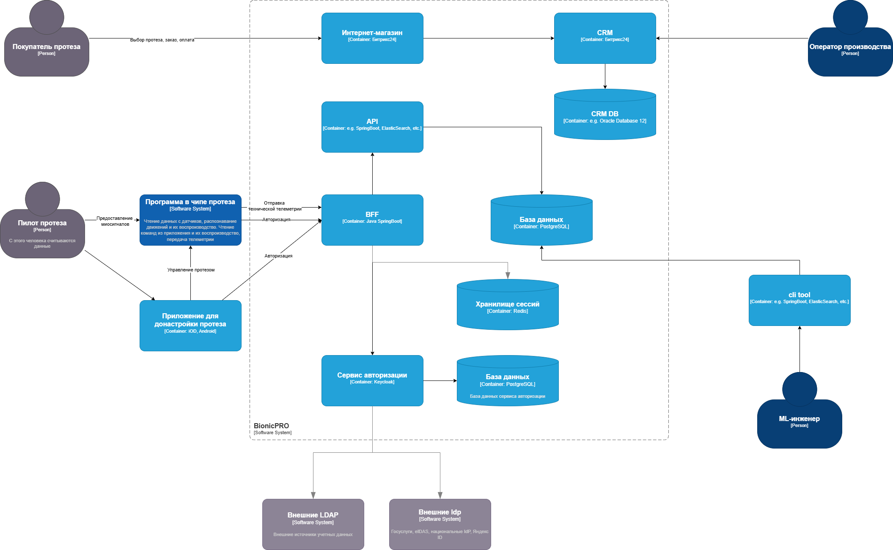

### Задание 2. Улучшите безопасность существующего приложения, заменив Code Grant на PKCE.

#### Что было сделано:

1. Во фронтенде:

Был сделан запрос на получение сессии пользователя. В случае если пользователь не авторизован происходит переход на страницу авторизации.

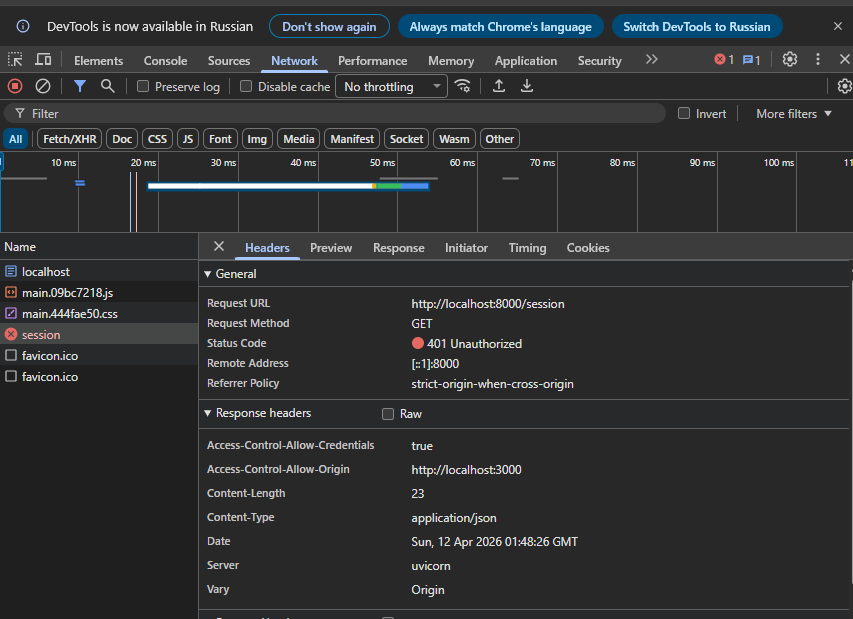

2. В конфигурации Keycloak (клиент reports-frontend):

    1. Установили `standardFlowEnabled: true` – разрешили Authorization Code Flow.
    2. Отключили `directAccessGrantsEnabled: false` – запретили небезопасный поток с паролем.
    3. Добавили атрибут `pkce.code.challenge.method: S256` – заставили Keycloak требовать PKCE.
    4. Клиент остался публичным (`publicClient: true`), так как SPA не может хранить client_secret.

#### Зачем это нужно:

Code Grant без PKCE уязвим для перехвата авторизационного кода (например, через подмену URL в WebView). Злоумышленник, получив код, мог обменять его на токены.

PKCE генерирует случайную строку (code_verifier) и её хеш (code_challenge). При обмене кода на токены требуется предъявить code_verifier, который злоумышленник не знает. Это защищает от перехвата кода даже на небезопасном канале.

#### Итог:

Успешно повысили безопасность аутентификации в SPA, внедрив современный стандарт PKCE. Это требование было ключевым для предотвращения утечки данных пользователей.

### Задание 3. Обеспечьте безопасное получение и хранение access-и refresh-токенов.

Вынесли всю логику работы с токенами из фронтенда в отдельный сервис `bionicpro-auth`. Это полностью исключило хранение и передачу токенов на клиент.

#### Что было сделано:

1. Создан сервис bionicpro-auth (Python/FastAPI)

    ##### Эндпоинты:
    - /login – редирект на Keycloak.
    - /callback – обмен кода на токены, создание сессии.
    - /api/protected – пример защищённого ресурса.
    - /session – проверка статуса сессии.
    - /logout – завершение сессии.
    - /api/reports – проксирование запросов к reports-api.

#### Хранение токенов:

1. access_token – в оперативной памяти или Redis.
2. refresh_token – зашифрован (Fernet) и сохранён там же.

#### Сессионная cookie:

HttpOnly, Secure (в проде), SameSite=Lax.

Содержит только session_id.

Ротация сессии: при каждом запросе к защищённому ресурсу генерируется новый session_id, старая сессия удаляется, cookie обновляется (защита от session fixation).

Автоматическое обновление токенов: если access_token истекает, сервис авторизации сам обновляет его через refresh_token.

2. Настроен Keycloak

   - Время жизни access_token установлено в 2 минуты ("access.token.lifespan": "120").
        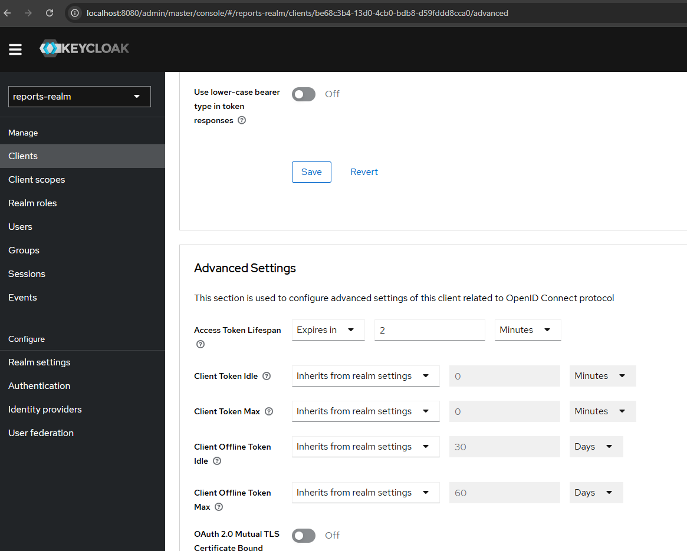
   - Клиент bionicpro-auth настроен как confidential (с client_secret).

3. Изменён фронтенд

    - Удалена прямая интеграция с Keycloak (keycloak-js больше не используется).
    - Все запросы к защищённым ресурсам идут через BFF с credentials: 'include' (сессионная cookie передаётся автоматически).

#### Итог:
Создали полноценный сервис авторизации, который изолирует клиента от прямого взаимодействия с Keycloak, обеспечивая безопасное хранение и обновление токенов.

### Задание 4. Добавьте LDAP для возможности получения данных о пользователях представительства BionicPRO в другой стране.

Добавили LDAP для возможности получения данных о пользователях BionicPRO в другой стране. Это позволило Keycloak использовать внешний LDAP-сервер как источник учётных записей и ролей.

#### Что было сделано:

1. Развёрнут OpenLDAP-сервер
    
    В docker-compose.yml добавлен сервис openldap (образ osixia/openldap).

2. Настроены переменные окружения:
    - LDAP_ORGANISATION: "BionicPRO"
    - LDAP_DOMAIN: "example.com"
    - LDAP_ADMIN_PASSWORD: "admin"
    - LDAP_CONFIG_PASSWORD: "config"
    - LDAP_TLS: "false"

3. Создан файл config.ldif с:

   - Организационными единицами (ou=People, ou=Groups).
   - Пользователями (john.doe, jane.smith, alex.johnson).
   - Группами-ролями (cn=user, cn=prothetic_user) с членством.

4. Настроен Keycloak для работы с LDAP
    
    В realm-export.json добавлен LDAP-провайдер (UserStorageProvider):

    ```bash
    connectionUrl: ldap://openldap:389
    usersDn: ou=People,dc=example,dc=com
    bindDn: cn=admin,dc=example,dc=com
    bindCredential: admin
    userObjectClasses: inetOrgPerson
    usernameLDAPAttribute: uid
    rdnLDAPAttribute: uid
    uuidLDAPAttribute: entryUUID
    editMode: READ_ONLY
    importEnabled: true
    ```

5. Добавлен маппинг ролей (group-ldap-mapper)

    Группы LDAP синхронизируются в роли Keycloak:
     - cn=user → роль user
     - cn=prothetic_user → роль prothetic_user

    Параметры маппера:
   - groups.dn: ou=Groups,dc=example,dc=com
   - group.name.ldap.attribute: cn
   - membership.ldap.attribute: member

#### Зачем это нужно:

1. Унификация доступа: учётные данные хранятся в централизованном корпоративном LDAP, а не в Keycloak.

2. Поддержка разных представительств: в каждой стране можно развернуть свой LDAP-сервер (или указать другой usersDn), а Keycloak будет работать с ним через федерацию.

3. Синхронизация ролей: группы LDAP автоматически становятся ролями Keycloak, что упрощает управление правами.

#### Итог:
Интегрировали Keycloak с OpenLDAP, настроили импорт пользователей и синхронизацию ролей. Теперь Keycloak может аутентифицировать пользователей из внешнего LDAP-каталога, что соответствует требованию "получения данных о пользователях представительства BionicPRO в другой стране".

#### Скриншоты:

##### Список провайдеров:
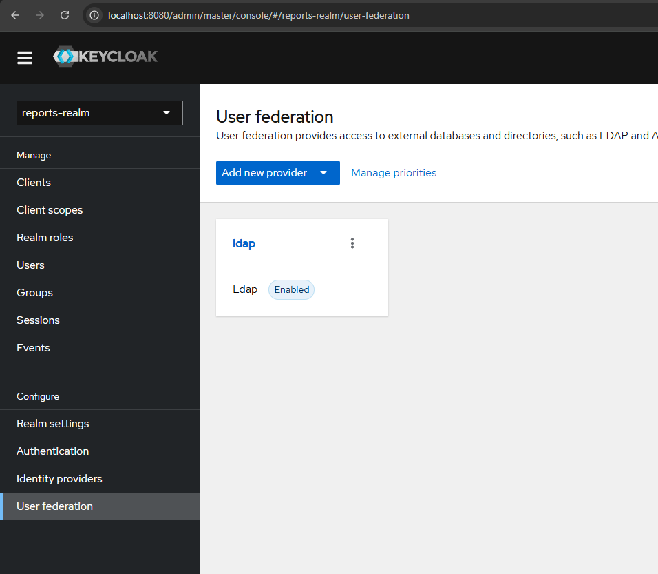

##### Пример синхронизации пользователей:
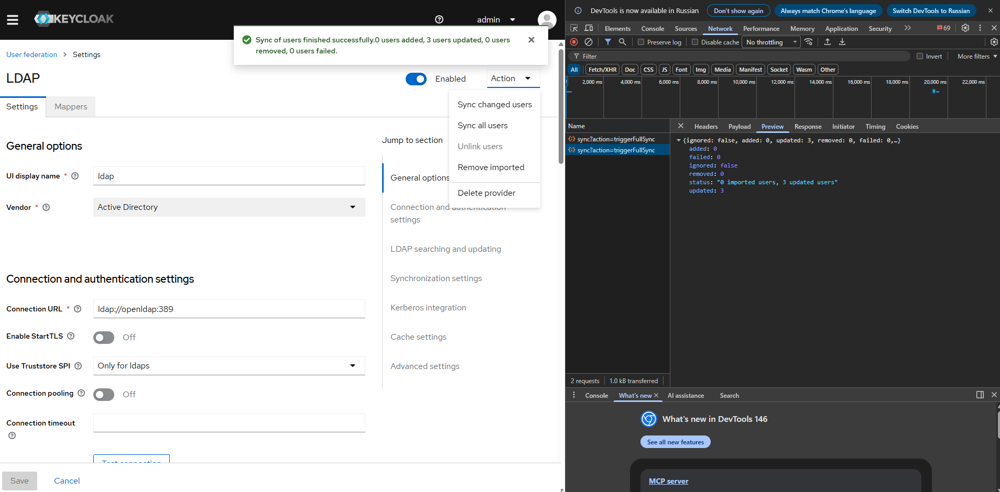

##### Список синхронизированных пользователей:
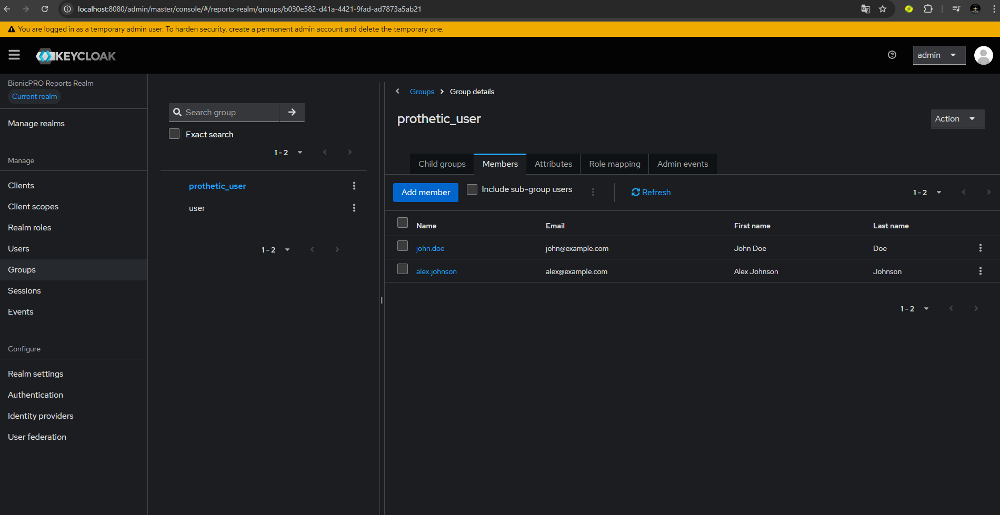

### Задание 5. Настройте MFA.

Настроили MFA (многофакторную аутентификацию) через OTP (одноразовый пароль) в Keycloak. Это обязало всех пользователей при входе вводить не только логин/пароль, но и одноразовый код из Google Authenticator или FreeOTP.

#### Что было сделано:

1. Включена обязательная OTP-аутентификация
    
    В realm-export.json в разделе requiredActions установлено:

    ```json
    {
    "alias": "CONFIGURE_TOTP",
    "defaultAction": true   // ← пользователи обязаны настроить OTP
    }
    ```

2. Настроен браузерный flow с OTP

    Создан кастомный flow browser with OTP:

    В browser with OTP forms последовательно выполняются:

    1. auth-username-password-form (логин/пароль)
    2. auth-otp-form (одноразовый код)
    3. Активный browserFlow переключён на browser with OTP.

3. Настроены параметры OTP-политики

   - otpPolicyType: totp – алгоритм TOTP.
   - otpPolicyDigits: 6 – длина кода.
   - otpPolicyPeriod: 30 – период действия кода (30 секунд).

#### Архитектура аутентификации:

```text
Пользователь
     │
     ▼
Ввод логина/пароля
     │
     ▼ (если успешно)
Проверка: настроен ли OTP? (requiredAction)
     │
     ├── Нет → страница настройки OTP (сканирование QR-кода)
     │         после настройки → вход
     │
     └── Да → запрос OTP-кода (6 цифр)
              │
              ├── код верен → доступ разрешён
              └── код неверен → ошибка

```

#### Зачем это нужно:

   1. Повышение безопасности: даже если злоумышленник украдёт пароль, он не сможет войти без одноразового кода.
   2. Защита от компрометации учётных записей: особенно важно для медицинских данных и персональной информации.
   3. Соответствие требованиям законодательства: многие страны требуют MFA для доступа к чувствительным данным.

#### Итог:

Успешно настроили обязательную двухфакторную аутентификацию в Keycloak. Теперь ни один пользователь (включая новых) не может войти в систему без настройки и ввода OTP-кода из приложения-аутентификатора (Google Authenticator, FreeOTP). Это полностью закрывает требование задания 1.5.

#### Скриншоты:

##### Форма добавления OTP:
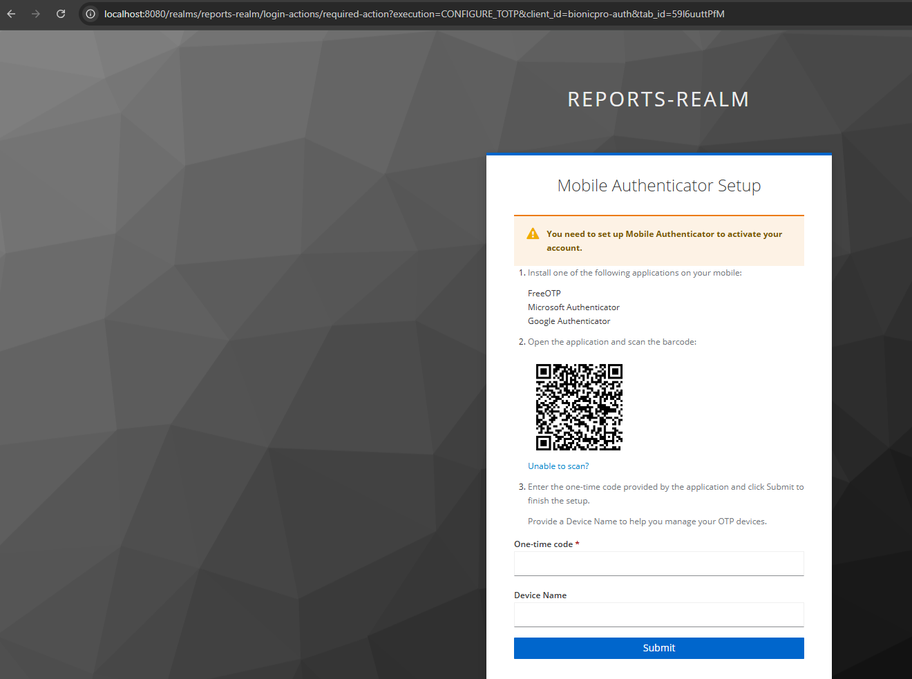

##### Flow с обязательным OTP:
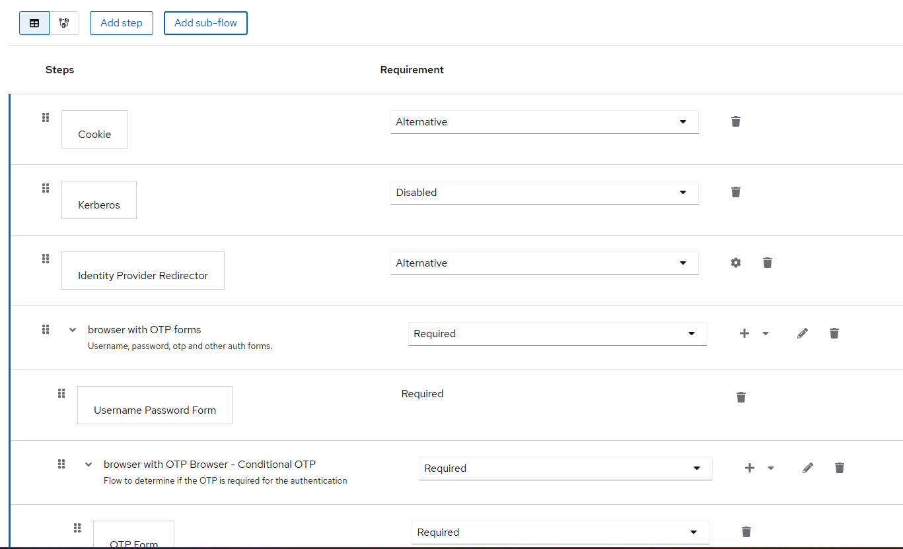

### Задание 6. Добавьте OAuth 2.0 от Яндекс ID.

Добавили OAuth 2.0 от Яндекс ID через механизм Identity Brokering в Keycloak. Это позволило пользователям входить в систему BionicPRO, используя свои учётные записи Яндекса.

#### Что было сделано:

1. Добавлен Identity Provider Яндекс ID в Keycloak

    В realm-export.json добавлен провайдер yandex типа yandex:

```json
"identityProviders": [
    {
      "alias": "yandex",
      "displayName": "Яндекс ID",
      "internalId": "b5c87c65-64a1-46b3-bce5-ace9d2dba054",
      "providerId": "yandex",
      "enabled": true,
      "trustEmail": true,
      "storeToken": true,
      "linkOnly": false,
      "hideOnLogin": false,
      "firstBrokerLoginFlowAlias": "first broker login",
      "config": {
        "clientId": "f61f6cee264e4a35b9e907c9b3989b86",
        "acceptsPromptNoneForwardFromClient": "false",
        "disableUserInfo": "false",
        "showInAccountConsole": "ALWAYS",
        "filteredByClaim": "false",
        "syncMode": "IMPORT",
        "forceConfirm": "false",
        "clientSecret": "**********",
        "caseSensitiveOriginalUsername": "false",
        "defaultScope": "login:email login:info"
      },
      "types": []
    }
]
```

2. Настроены мапперы атрибутов

    В identityProviderMappers добавлены преобразования полей из Яндекс ID в атрибуты пользователя Keycloak:

    | Поле в Яндексе | Атрибут в Keycloak |
    | --- | --- |
    | default_email | email |
    | first_name | firstName |
    | last_name | lastName |
    | login | username |

3. Настроен First Broker Login Flow
    
    При первом входе через Яндекс ID Keycloak запрашивает у пользователя разрешение на использование данных (согласие).
    Данные профиля импортируются и сохраняются в БД Keycloak.

```text
Пользователь
     │
     ▼
Нажимает кнопку "Яндекс ID" на странице входа Keycloak
     │
     ▼
Keycloak редиректит на oauth.yandex.ru
     │
     ▼
Пользователь вводит логин/пароль Яндекса
     │
     ▼
Яндекс запрашивает разрешение на доступ к данным (email, имя)
     │
     ▼
Пользователь даёт согласие
     │
     ▼
Яндекс возвращает код → Keycloak обменивает на токены
     │
     ▼
Keycloak запрашивает userinfo (данные профиля)
     │
     ▼
Мапперы сохраняют данные в учётную запись Keycloak
     │
     ▼
Пользователь входит в систему BionicPRO
```

#### Зачем это нужно:

1. Удобство пользователей: можно войти без создания отдельной учётной записи.
2. Сохранение данных профиля: сервис протезов получает данные пользователя из Яндекса.
3. Прозрачность: пользователь явно даёт разрешение на использование своих данных (согласие).

#### Итог:

Успешно интегрировали Яндекс ID как внешний Identity Provider. Теперь пользователи могут входить через свои аккаунты Яндекса, а Keycloak автоматически импортирует их данные (email, имя, фамилию) в систему BionicPRO. Это полностью закрывает требование задания 1.6.

#### Скриншоты:

##### Список провайдеров:
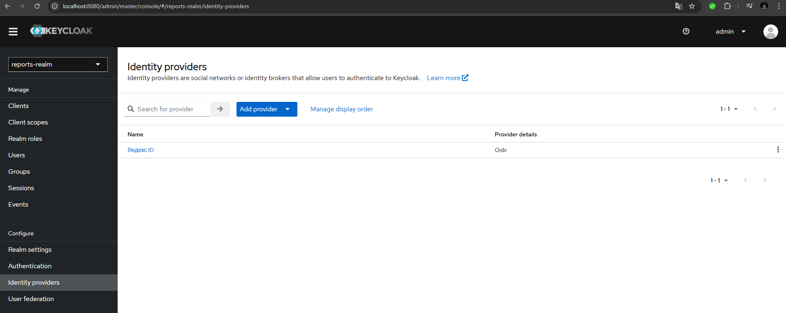

##### Страница провайдера:
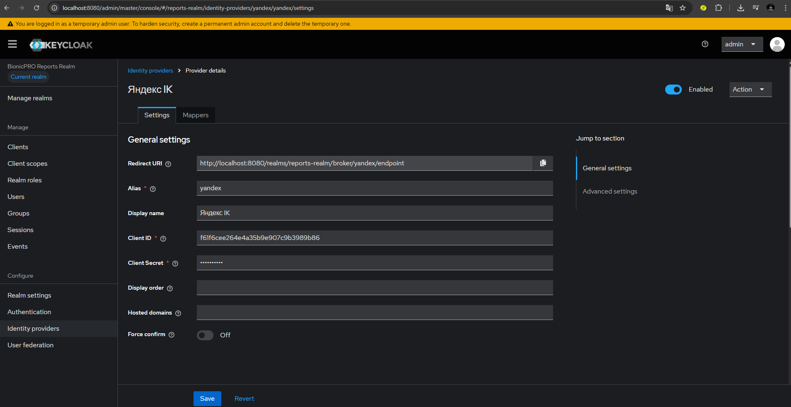

##### Кнопка авторизации через Яндекс ID:
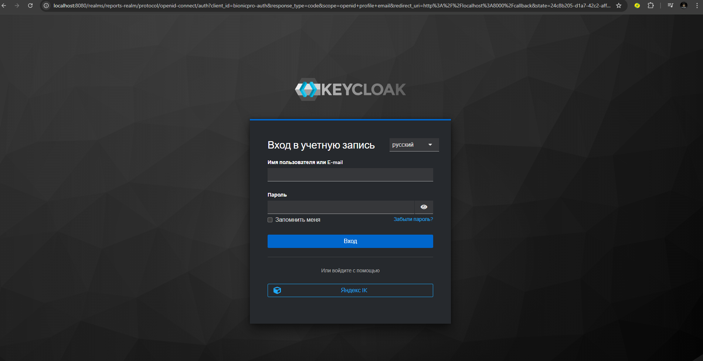

##### Страница авторизации Яндекс:
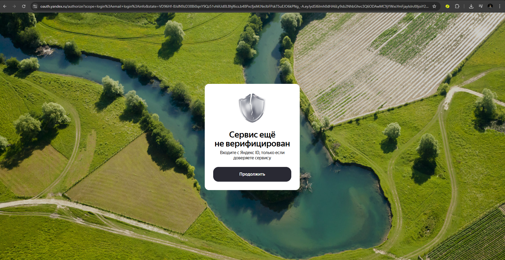

##### Страница авторизации Яндекс 2:
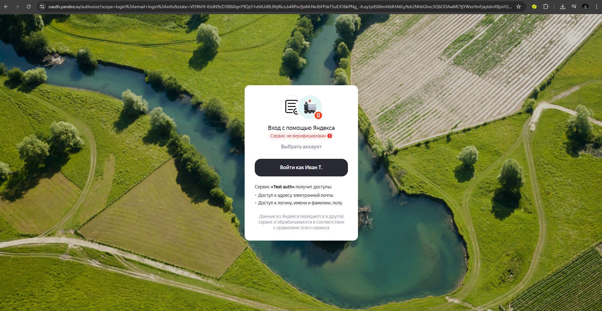

##### Созданная сессия после авторизации:
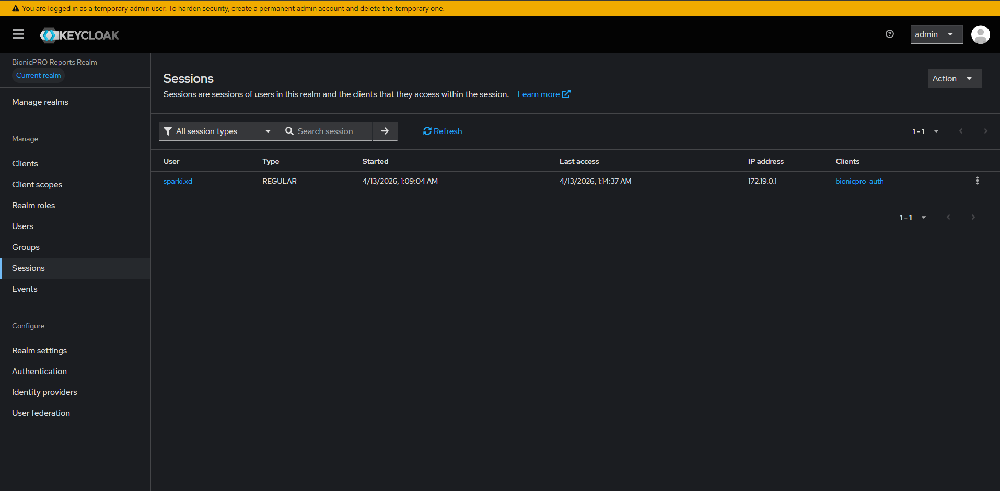

## Задание 2. Разработка сервиса отчётов

### Задание 1. Создать архитектуру решения для подготовки и получения отчётов.

Была подготовлена архитектура решения для подготовки и получения отчётов:

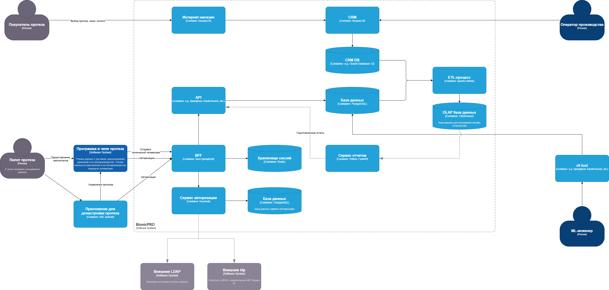

### Задание 2. Разработать Airflow DAG и настроить его на запуск по расписанию.

#### Что сделано:

Разработан DAG etl_user_analytics (файл airflow/dags/reports-etl.py), который реализует ETL-процесс для формирования витрины отчётности.

#### Структура DAG:

1. create_table – создаёт таблицу user_analytics в ClickHouse (движок MergeTree, порядок сортировки по report_date, user_id для быстрого доступа по пользователям).

2. extract_crm – извлекает данные о клиентах из CRM (PostgreSQL) через PostgresHook.

3. extract_telemetry_agg – агрегирует телеметрию (количество сессий, общая длительность, среднее время отклика) за последние сутки.

4. transform_and_join – объединяет данные из CRM и телеметрии, добавляет дату отчёта.

5. load_to_clickhouse – загружает результат в ClickHouse, предварительно удаляя устаревшие записи за текущую дату.

#### Расписание:

DAG запускается ежедневно в 1:00 (schedule='0 1 * * *'). Параметр catchup=False исключает выполнение за пропущенные интервалы.

#### Технологии:

Apache Airflow 2.7.3, провайдеры apache-airflow-providers-postgres, airflow-clickhouse-plugin, библиотека pandas.

#### Результат:

Витрина user_analytics в ClickHouse содержит данные, сгруппированные по пользователям, что обеспечивает быстрый доступ к отчётам через API.

#### Проверка работоспособности:

DAG отображается в веб-интерфейсе Airflow, может быть запущен вручную или по расписанию.

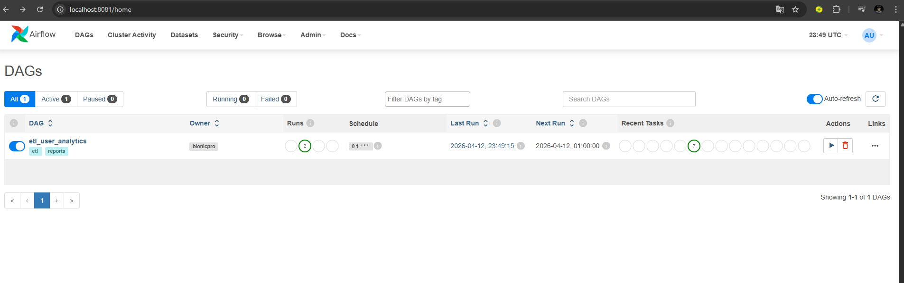

Все задачи завершаются успешно (зелёные статусы в UI).

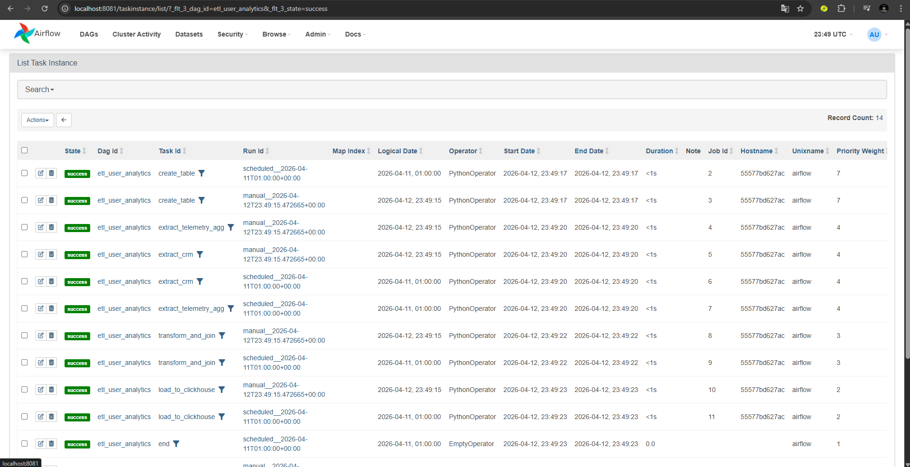

Данные корректно записываются в ClickHouse (подтверждается запросом SELECT * FROM user_analytics).

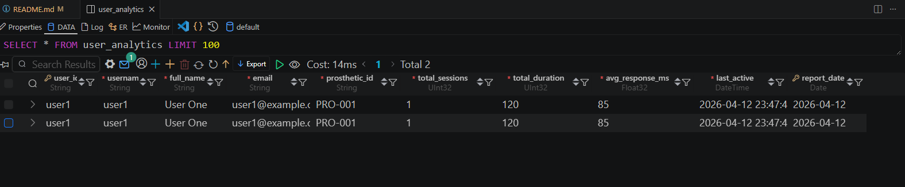

### Задание 3. Создайте бэкенд-часть приложения для API.

#### Что сделано:

1. Разработан отдельный микросервис `reports-api` на языке Python с использованием фреймворка FastAPI.

   - Код сервиса находится в папке bionicpro-reports/.
   - Основной файл: main.py.

2. Реализован эндпоинт /reports/{user_id}:

   - Принимает user_id в пути запроса.
   - Требует авторизации через JWT-токен, переданный в заголовке Authorization: Bearer <token>.
   - Валидирует токен через публичный ключ Keycloak (JWKS endpoint).
   - Извлекает из токена user_id (поле sub или email).
   - Сравнивает user_id из токена с запрошенным в URL. Доступ разрешён только если они совпадают (ограничение доступа).

3. Подключение к OLAP-базе данных ClickHouse:

   - Используется библиотека clickhouse-driver.
   - Параметры подключения (хост, порт, пользователь, пароль) вынесены в переменные окружения (config.py).
   - Эндпоинт выполняет SQL-запрос к витрине crm_target (или user_analytics) для получения данных пользователя.
   - Отчёт возвращается в формате JSON.

4. Контейнеризация и интеграция в Docker Compose:

   - Написан Dockerfile для сборки образа reports-api.
   - Сервис добавлен в docker-compose.yml с портом 8002 и зависимостями от ClickHouse и Keycloak.
   - Переменные окружения передаются через environment.

5. Обеспечена безопасность и изоляция:

   - Сервис не хранит состояние, все запросы stateless.
   - Отчёты не генерируются на лету, а только читаются из уже подготовленной витрины (это снижает нагрузку на OLAP).

#### Результат:

Сервис reports-api полностью реализует функциональность выдачи пользовательских отчётов. Он запускается в Docker, интегрируется с ClickHouse и Keycloak, отвечает на запросы по протоколу HTTP, возвращает данные в JSON. Доступ к отчёту ограничен только для владельца данных.

#### Проверка работоспособности:

После запуска всех сервисов можно выполнить:

```bash
curl -X GET "http://localhost:8002/reports/user1@bionicpro.com" \
  -H "Authorization: Bearer <access_token>"
```

### Задание 4. Реализуйте ограничение доступа к эндпоинту отчётности.

#### Что было сделано:

1. Добавлена проверка JWT-токена в сервис `reports-api`.
    - Использован публичный ключ Keycloak (JWKS endpoint) для валидации подписи.
    - Из токена извлекается идентификатор пользователя (sub или email).
2. Сравнение идентификаторов в эндпоинте `/reports/{requested_user_id}`:
    - Если requested_user_id (из URL) не равен current_user_id (из токена), возвращается ошибка 403 Forbidden с сообщением Access denied.
    - В противном случае отчёт выдаётся.

3. Код выглядит так (пример из main.py):

    ```python
    @app.get("/reports/{requested_user_id}", summary="Получить отчёт по пользователю")
    async def get_report(
        requested_user_id: str,
        current_user_id: str = Depends(get_current_user),
        ch: Client = Depends(get_clickhouse_client)   # FastAPI подставит клиент из генератора
    ):

        if requested_user_id != current_user_id:
            raise HTTPException(status_code=403, detail="Access denied")
        # ... остальная логика получения отчёта
    ```

4. Безопасность: даже если злоумышленник подставит чужой user_id в URL, сервис не выдаст данные, так как токен принадлежит другому пользователю.

#### Результат:

1. Авторизованный пользователь может запросить только свой отчёт.
2. Доступ к чужим данным запрещён.

### Задание 5. Добавьте в UI кнопку получения отчёта и вызова эндпоинта его генерации.

#### Важно перед проверкой

- Перед первым запросом отчёта необходимо, чтобы **Airflow DAG** `etl_user_analytics` выполнился хотя бы один раз и создал таблицу `user_analytics` в ClickHouse.
- По умолчанию DAG настроен на ежедневный запуск в 01:00. Для немедленного тестирования запустите его вручную через интерфейс Airflow (`http://localhost:8081` → DAG `etl_user_analytics` → Trigger DAG).

#### Что было сделано:

1. Фронтенд (React) – компонент `ReportPage.tsx`:

    - Добавлена кнопка "Download Report".
    - При нажатии вызывается асинхронная функция `downloadReport`, которая отправляет GET-запрос к BFF на `/api/reports` с `credentials: 'include'`.
    - Обрабатываются ошибки (401 – перенаправление на логин, другие – вывод сообщения).
    - После получения ответа отображается содержимое отчёта (JSON) в виде преформатированного блока.

2. BFF (bionicpro-auth) – добавлен эндпоинт `/api/reports`:

    - Проверяет сессию пользователя (через `get_current_session`).
    - Извлекает `user_id` из сессии или из `access_token`.
    - Проксирует запрос к `reports-api`, передавая токен в заголовке Authorization: Bearer <access_token>.
    - Возвращает ответ от `reports-api` обратно фронтенду.

3. Сервис отчётов (`reports-api`) – уже имел эндпоинт `/reports/{user_id}`, который отдаёт отчёт (с ограничением доступа, реализованным в задании 2.4).

#### Результат:

1. Пользователь видит на странице кнопку.
2. При нажатии получает свой отчёт без необходимости вручную формировать запросы.
3. Реализована полная интеграция: фронтенд → BFF → reports-api → ClickHouse.

#### Скриншоты:

##### Кнопка загрузки отчетов
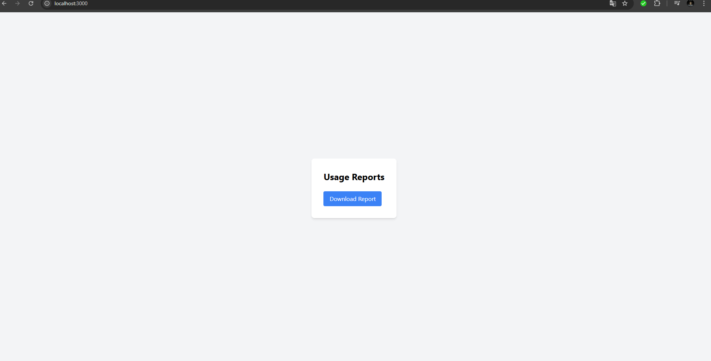

##### Пример ответа
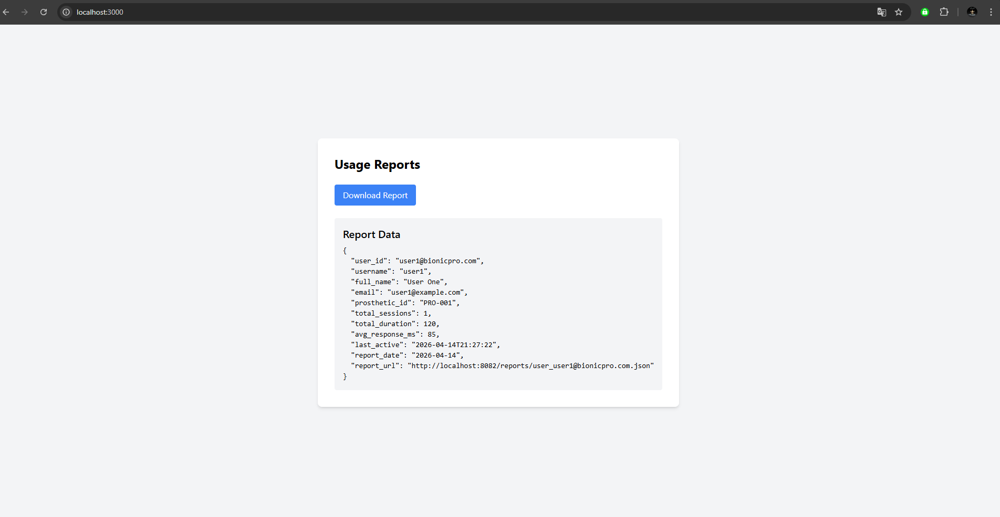

## Задание 3. Снижение нагрузки на базу данных

### Что было сделано:

1. Добавлен сервис Minio в docker-compose.yml – S3-совместимое хранилище для файлов отчётов.
2. Добавлен сервис Nginx с настройками reverse proxy и кэширования (конфиг nginx/nginx.conf).
3. В reports-api добавлена логика работы с S3:

    - Функция `report_exists(user_id)` – проверяет, есть ли файл отчёта в Minio.
    - Функция `save_report(user_id, data)` – сохраняет отчёт в Minio.
    - Функция `get_cdn_url(user_id)` – возвращает URL отчёта на CDN.

4. Изменён эндпоинт `/reports/{user_id}`:

    - Сначала проверяет наличие отчёта в S3.
    - Если есть – сразу возвращает ссылку на CDN ({"report_url": "http://localhost:8082/reports/user_user1.json"}).
    - Если нет – генерирует отчёт из ClickHouse, сохраняет в Minio и возвращает ссылку.

5. Настроен Nginx:

    - Проксирует запросы к Minio.
    - Кэширует ответы на 1 час (`proxy_cache_valid 200 1h`).
    - Добавляет заголовок X-Cache-Status (HIT/MISS).

### Результат:

1. При первом запросе отчёт генерируется и сохраняется в Minio, возвращается ссылка на CDN.
2. При повторных запросах того же отчёта данные отдаются из кэша Nginx (или из Minio, если кэш устарел), не нагружая ClickHouse.
3. Нагрузка на OLAP-базу существенно снижена.

### Скриншоты:

#### Список отчетов
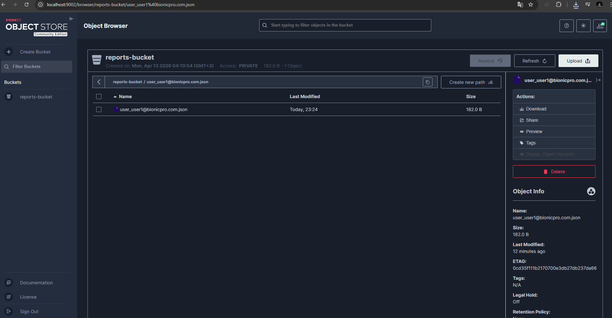

#### Пример отчета
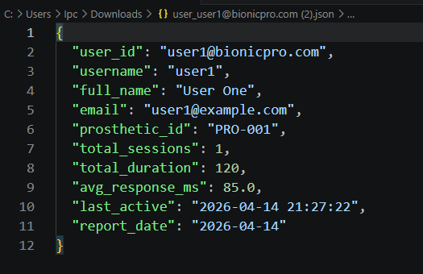

## Задание 4

Для регистрации коннектора Debezium необходимо выполнить команду:

```bash
bash debezium/register-connector.sh
```

### Что было сделано:

1. Настроен PostgreSQL (CRM) для логической репликации:

    - В `docker-compose.yml` добавлен сервис `postgres-crm` с параметрами `wal_level=logical, max_wal_senders, max_replication_slots`.
    - Создана таблица `customers` и публикация `debezium_pub` для неё.

2. Развёрнуты Kafka и Debezium:

    - Добавлены сервисы `zookeeper, kafka, debezium (Debezium Connect)`.
    - Написан скрипт `debezium/register-connector.sh` для регистрации коннектора PostgreSQL → Kafka.

3. Настроен ClickHouse для приёма данных из Kafka:

    - Создана таблица `crm_kafka_queue` (движок Kafka) для чтения топика `crm.public.customers`.
    - Создана целевая витрина `crm_target` (движок ReplacingMergeTree) для хранения актуальных данных с поддержкой обновлений.
    - Создано материализованное представление `crm_mv`, которое парсит JSON-сообщения из очереди и записывает их в `crm_target`.

4. Переключён сервис отчётов (`reports-api`) на чтение из новой витрины `crm_target` вместо старых таблиц.

### Результат:

1. Любое изменение в таблице `customers` CRM (INSERT, UPDATE, DELETE) автоматически попадает в Kafka через Debezium, а затем в ClickHouse.
2. OLAP-база всегда содержит актуальную копию данных CRM, не нагружая её аналитическими запросами.
3. Транзакционная CRM работает стабильно, без замедлений из-за массовых выгрузок.

### Скриншоты

#### Регистрация коннектора Debezium:

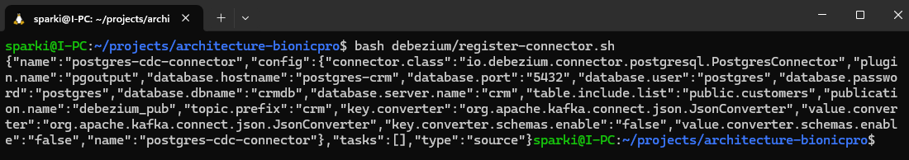

#### Статус Debezium коннектора:

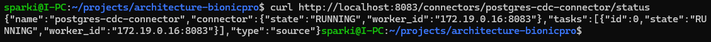

#### Сообщение в топике Kafka:

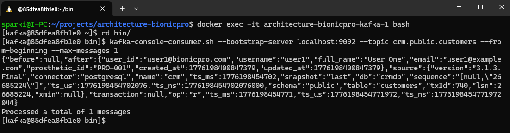

#### Данные в MaterializedView

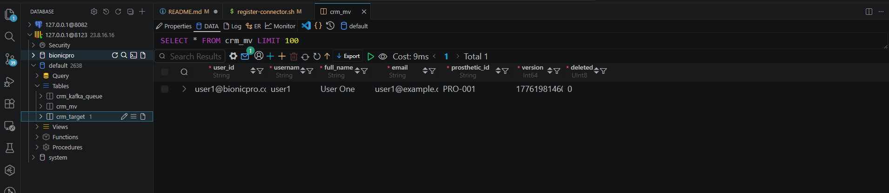

